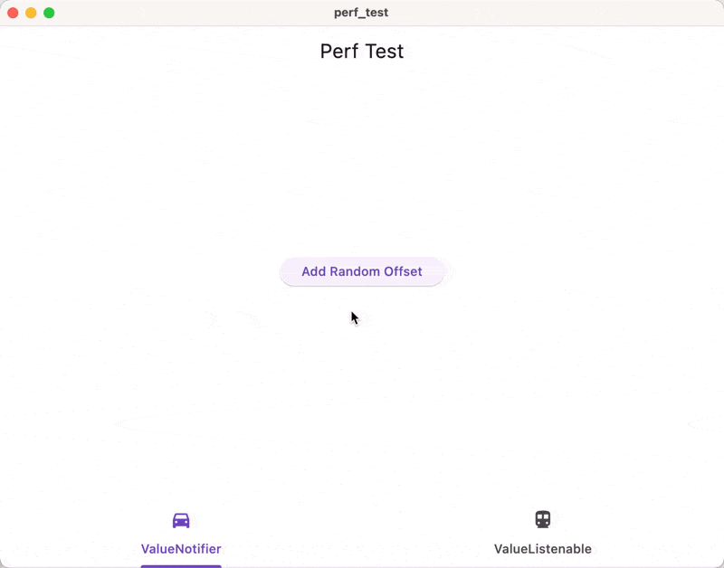

- [Github Link](https://github.com/Parkour-Labs/dust)
- [Read on Medium](https://medium.com/@wxxedu/introducing-dust-v0-0-1-0ff28437a82b)

**This is going to get us embarrassed real bad. Please don’t laugh at us if you
think we are stupid.**

I wasn’t really going to release this out loud to the public, but I realized
that we are at a stage where we need some feedback and a little nudge from the
community. Having this project worked on and used “internally” on an
yet-to-launch note-taking app will not get it anywhere.

**Be warned that dust is far far from mature yet**. The API is different from
what we show here (we are doing a major API refactoring which would take us
about a week’s time). Many critical features are missing. No sensible docs.
You probably would have difficulty getting it building for your app because we
tried to run Rust with Flutter. We haven't even published on pub.dev. Oh, by
the way, the package name is still qinhuai, which is what we used to call it
and we haven’t updated that yet.

However, if you aren't afraid of getting your hands dirty with git submodules
and cargo or shooting yourself in the foot by using a
constantly-having-massive-breaking-changes database/state management solution,
you are welcome to try it out in your new pet Flutter project!

Regardless, here is our [telegram](https://t.me/dustdb) link. Do hop in and
give us some feedback and encouragement :-)

## What is the problem?

As a front-end developer, there are three major things that we need to worry
about and cause the most amount of trouble for us: state management,
persistence, and synchronization. dust is our attempt to settle all these three
questions at once.

The problem that we see with existing solutions is that they often require you
to manage so many different things. As a front-end developer, you often need
to ensure that

1.  The UI state and the application state are in sync;

2.  The application state and the local database state are in sync;

3.  The local database state and the remote state are in sync (if you choose
    to support cross-platform sync).

If any of these things are not correctly managed, you will have a buggy
application. And if there is anything that I know about synchronization, it
would be that it is hard. Super hard. How hard?

Spotify desktop’s “Friends Activity” barely worked on my friend’s machine:


Google’s YouTube on iOS had a lot of UI glitches for me when I tried to switch
from dark mode to light mode. (Can’t find a screenshot right now).

And these are not just some random small development teams doing these apps.
They are huge companies with a large team dedicated to the development. Yet,
there are still problems in managing the front-end state somehow.

Further, as a front-end developer, I often find myself engaged in this mental
model of a View, a ViewModel, and Models, which would often lead me into
this loophole of duplicating the same or similar code in several different
places. Are these things really necessary? Can't a Model itself just somehow
be a ViewModel?

> _“This is impossible. You must be absurd.”_

Yes, I agree. Things that exist do exist for a reason.

However, not every app is like YouTube or Spotify or whatever that needs to
handle sophisticated use cases and massive amounts of data. People share about
technology that they are proud of, and more often than not, these technical
solutions tend to be very nerdy and hard ones.

More often than not, we can’t afford to do like what they did. And in most
situations, we DON’T NEED to do what they do. You don’t need to have AWS
Cognito User Pool linked with DynamoDB and lots of custom resolvers with
API Gateway and GraphQL to build a to-do list app or a small app for your
business. You also don’t need to implement clean architecture in any way or
shape or form.

What you need is to think about the specific problems and use cases that
matter, and try to address the business logic directly with minimum friction
from what your solution is. That’s what we built dust for.

## What leads us here

> _Skip to [here](#introducing-dust) if you are not interested in how
> we arrived at dust._

In roughly around Jan. 2021, my first year of college, I discovered Flutter.
In my last year of high school, I worked at MarginNote for 6 months and had a
decent amount of experience in the productivity software region. At that time,
it was still a big problem where the majority of nice-to-use productivity
software was on the iOS side. As a result, we started building an app called
dynote.

As we started building, quickly two problems emerged: **state management
solutions being sub-optimal** and **lack of a database solution** that checked
all the boxes for us.

### State Management

We swapped out several different state management solutions, from BLoC to MobX
to Riverpod, but none worked for us.

#### Are Immutable Data Better?

The first issue that we had with those very advanced state management solutions
is that they often rely on **data immutability**. This is because, with
immutable data, you can have a quick comparison between two objects, hence
allowing the library to be notified of when a change occurred.

```dart
// In order for any state management solutions to work
points.value = [...points.value, newPoint];
```

However, this does not look ideal to us, as we were dealing with lots of stroke
points per stroke that get updated quite frequently. This would be equivalent
to having an \\(O(n^2)\\) operation every time we need to add something to the
stroke.

Granted, the UI still needs to be redrawn every time we make an update to the
list, but having to copy the object again every time that we make an update
does not feel nice. And, there is a difference in the real world too.

I did a simple dirty test of rendering 10000 dots on a canvas with the two
different variants of notifiers, one that which a copy of a list is made each
time we update something and another where we just simply add to the list.

```dart
final class ListNotifier<T> extends ChangeNotifier
    implements ListNotifierBase<T> {
  ListNotifier(this.value);

  @override
  final List<T> value;

  @pragma('vm:prefer-inline')
  @override
  void add(T item) {
    // using a mutable list and then crow.
    value.add(item);
    notifyListeners();
  }
}

final class ListCopyNotifier<T> extends ValueNotifier<List<T>>
    implements ListNotifierBase<T> {
  ListCopyNotifier(super.value);

  @pragma('vm:prefer-inline')
  @override
  void add(T item) {
    // similar to the normal copy action that you would perform.
    value = [...value, item];
  }
}
```

I don’t know how to measure the performance, but as can be shown here,
there is a huge performance difference when I try to consecutively add 10000
points to the UI.



> The tab on the left is using the `ListNotifier` and the one on the right is
> using the `ListCopyNotifier`.

Compared with just manually calling notify every time, a significant portion
of the CPU is wasted on doing the ListCopyNotifier.add method.

An initial idea would be inside the [freezed](https://pub.dev/packages/freezed)
data class, we set the `makeCollectionsUnmodifiable` flag to false. This allows
us to modify the collection inside a data class.

```dart
@Freezed(makeCollectionsUnmodifiable: false)
class Stroke with _$Stroke {
  const Stroke._();
  const factory Stroke({@Default([]) List<Offset> points}) = _Strole;

  Stroke withAddPoint(Offset point) {
    points.add(point);
    return this;
  }
}
```

However, this alone won’t work with most of the state management solutions.
Because you are simply returning this, the comparison would end here, and it
would not trigger an update in most of the state managers. We will have to
work around the "smart" rendering-saving techniques of those state managers
to force an update:

```dart
@Freezed(makeCollectionsUnmodifiable: false)
class Stroke with _$Stroke {
  const Stroke._();
  const factory Stroke({
    @Default([]) List<Offset> points,
    @Default(0) int forceUpdate,
  }) = _Strole;

  Stroke withAddPoint(Offset point) {
    points.add(point);
    return copyWith(forceUpdate: forceUpdate += 1);
  }
}
```

This would ensure that the equality checks between two states fail, therefore
allowing the UI to be re-rendered. Having to dig through the source code of the
state management library and try to bypass its limitations was not pleasant.

**This leads us to ask the question: at the end of the day, is it true that
immutable data are better than mutable ones?**

#### Duplication of States

Another thing that you may have noticed, is that to cater to the needs for
different state management solutions, we have to often create two sets of
models representing the same data. One set is used to be persisted to the local
disk, and the other set is to be used to update the user interface.

For example, I could have a stroke that’s a list of points declared in Isar:

```dart
@Collection
class Stroke {
  // ..
  List<Point> points;
}
```

There is no way for me to directly modify the points of this model while still
keeping the UI updated, as the List<Point> does not offer any reactivity.
Often, you will need to create temporary variables that hold the `List<Point>`,
compound with reactivity, and then by the time you finish modifying a stroke,
you add it to the points stored in Isar.

And this is not just unique with strokes and points. Say that you are
designing a file system, where a Folder can be either a parent or one of the
children. It would be non-trivially hard to get everything right with the
database state and a state management solution. For example, if you try to
load the children and store them in your "ViewModel" of folders, what happens
if I move one of the children out? How does the underlying state work? How do
I notify other view models that such a change has occurred? Further, how do
I keep the UI state consistent with the data state?

Please don’t laugh at me: the naive me back then spent a lot of time
implementing the file management page for the note-taking app three times,
each time trying to fix some issue that randomly bumped up that I did not
previously think of. I thought it was a skill issue of mine that I could not
get everything right. Granted, there are certain elements of that. However,
now I also think that the current mental model of “MVVM” also contributed to a
lot of the complexity concerning such an issue. You need to try to make
different systems (the backend database, the state management solutions, and
the UI) talk to each other, and they may not have the most compatible API ever.

### Database

We not only had problems with state management, but we also had tons of issues
with persistence and synchronization. Coming from an iOS background, I thought
that allowing users to synchronize data across different platforms was a very
simple task. Boy was I so wrong.

|           | iOS | Android | MacOS | Windows | Linux | Web | Offline | Sync |
| --------- | --- | ------- | ----- | ------- | ----- | --- | ------- | ---- |
| Firebase  | ✅  | ✅      | ✅    | ❌      | ❌    | ✅  | 🟠      | ✅   |
| Amplify   | ✅  | ✅      | ❌    | ❌      | ❌    | ❌  | ✅      | ✅   |
| Isar      | ✅  | ✅      | ✅    | ✅      | ✅    | ❌  | ✅      | ❌   |
| ObjectBox | ✅  | ✅      | ✅    | ✅      | ✅    | ❌  | ✅      | ✅   |
| Supabase  | ✅  | ✅      | ✅    | ✅      | ✅    | ✅  | ❌      | ✅   |
| Appwrite  | ✅  | ✅      | ✅    | ✅      | ✅    | ✅  | ❌      | ✅   |

_🟠 Indicates that there is partial support._

However, supporting all of these platforms/features was one of our key
requirements when we were developing the app Dynote. Further, when we started,
Supabase and Appwrite were not as big as they are now.

Ant if you dive deeper into the database platform support, you will realize
that some of them are bad.

For example: I’ve hardly ever
seen a so-called “production-grade” software written worse than AWS Amplify.
Its DataStore does not work most of the time for me, for some obscure messages
that no one could understand. It promises local support, but only when you dive
in you realize that the local-first approach only works on mobile but on
desktop. It allows you to write interfaces in the GraphQL schema, but it never
generates the interface in Flutter code. There is no way of knowing how it
loaded its links, and it’s far from possible to keep the objects in sync across
different places. Since I am currently interning at a small business building
software for them and dealing with Amplify on a day-to-day basis, I could not
even count how many times I shot myself in the foot by using Amplify.

### As a result

We built dust.

It was mostly Bridgecat’s brain-child that dust is built. When I first
encountered issues with state management, I thought it was my skill issue
because although I started programming when I was 13 years old, I had always
been a casual programmer. It took me a long time back then to figure out that
if statements cannot directly live inside the body of a class.

Bridgecat, however, is a genius. He built a Minecraft clone when he was in 5th
grade using basic and OpenGL, and later on, rewrote it in C++ and OpenGL. He
also did competitive programming. However, when he mentioned to me this idea,
I was very skeptical. We were already slow in building the note-taking app
because we did not have enough time, and we needed to build a new database
and state-management solution, what? When is that going to be production-ready?
When are we going to ship the app?

However, we are just friends building apps together. We called our “company”
ParkourLabs and one of the core missions that we had was “friends having fun
together.” I voiced my rejection, and bridgecat ignored it and went to work.
I am glad he did.

## Introducing dust

> **\*WARNING**: The code shown below only indicate how dust's API will look
> like after we finish our current major refactoring (into using a freezed-like
> declaration style). We expect it to be done within a week by Feb 25, 2024. I
> want to publish dust by my birthday, so …\*

Dust is our attempt to solve the problems that we have encountered while
building the dynote app. Suppose that we are building a Todo list app
(not again~)

### Define a Model

dust's API is heavily inspired by freezed, the package that we as Flutter
developers love dearly for handling data classes and unions. For demo purposes,
let's assume that we are building a todo-list app. (Hey, who doesn't like to-do
lists?)

```dart
import 'package:dust/dust.dart';

part 'todo.dust.dart';

@Model()
class Todo with _$Todo {
  Todo._();

  factory Todo({
    required String name,
    String? description,
    @DustDft(false) bool isCompleted,
  }) = _Todo;
}
```

Then, run code generation with build_runner, and your model has been set!

```sh
dart run build_runner build --delete-conflicting-outputs
```

### Register the repository

The code shown above will generate an additional class named $TodoRepository.
The $ prefix is used to signify that it is generated code. For dust to work,
you will need to register the $TodoRepository with dust.

```dart
Future<void> main() async {
  final docsDir = await getApplicationDocumentsDirectory();
  final dataPath = p.join(docsDir.path, 'data.dust');
  Store.open(docsDir, [
    const $TodoRepository(),
  ]);
  // ... other code
}
```

Now you are all set!

### CRUD Operations

If you want to create a Todo, simply do as follows:

```dart
final todo = Todo(name: 'Write dust docs');
```

If you want to read a Todo, do as follows:

```dart
final todo = const $TodoRepository().get(todo.id);
```

If you want to update a Todo, simply do as follows:

```dart
todo.description$.set('It is so hard to document code.');
```

If you want to delete a Todo:

```dart
todo.delete();
```

If you want to query all the todos:

```dart
final todos = const $TodoRepository().all();
```

Look at the API above, and you will notice a few interesting things:

- You don’t have to worry about anything related to saving the data to the
  database. Dust handles them for you. You just need to focus on creating the
  model, using it, and deleting it when you need to.

- There is no async/await. Would it cause user-perceived lag? We think not.
  Native software generally does not deal with huge amounts of data, and modern
  databases are generally able to answer these queries at a very fast pace.

- We have yet to get to the network layer implementation yet, but the data will
  even be automatically synchronized once we get our hands on it!

### Links

One of the more advanced features in dust is the support of `Link`,
`Multilinks`, and `Backlinks` in both persistence and state management.
Say that now you want to add a tag:

```dart
@Model()
class Todo with _$Todo {
  Todo._();

  factory Todo({
    required String name,
    String? description,
    @DustDft(false) bool isCompleted,
    @Multilinks() List<Tag> tags,
  }) = _Todo;
}

@Model()
class Tag with _$Tag {
  Tag._();

  factory Tag({
    required String name,
    @ColorSerializer() @Default(Colors.orange) color,
    @Link Tag? parent,
    @Backlinks(to: "parent") List<Tag> children,
    @Backlinks(to: "tags") List<Todo> tags,
  }) = _Todo;
}
```

Then, dust would generate the corresponding fields for you with the
relationships maintained. If you create a Tag and set its parent to some other
Tag, then this Tag would appear in the children of the other Tag as well.
More importantly, both tags would be of the exact same instance. This means
that any transient fields that you store in the model can be used as a shared
runtime state.

```dart
final parent = Tag(name: "ParkourLabs");
final tag1 = Tag(name: "dust", parent: parent);

final tag2 = Tag(name: "dynote");
parent.children$.insert(tag2);

final toPrint = parent.children$.get(null).map((e) => e.name$.get(null)).join(',');
print(toPrint); // dust, dynote
print(tag1.parent$.get(null).name$.get(null)); // ParkourLabs
print(tag2.parent$.get(null).name$.get(null)); // ParkourLabs
assert(identical(tag1.parent$, parent$)); // true
assert(identical(tag2.parent$ == parent$)); // true
```

### State Management

If you have noticed the "ugly" `.get(null)` API and have been wondering why we
need to specify null in it. Here is the answer: you can optionally pass in an
Observer instance to observe the changes in the field, or you could choose to
use `.get(null)` to simply get the value inside without any reactivity.

The rationale behind us making the Observer required but optional is that we
want to remind you to explicitly think about whether you will need to subscribe
to an observer. Oftentimes, we tend to forget such matters, and it would be
difficult for us to realize or debug. While you may have to type more
characters, we believe that this is a justifiable sacrifice. (We are
implementing an optional flag where you can generate the convenient getters
if you so choose).

So here is how we implement a list of todos in dust:

```dart
class TodoList extends StatelessWidget {
  const TodoList();

  @override
  Widget build(BuildContext context) {
    // can choose a reactive widget
    return ReactiveBuilder(
       builder: (context, o) {
         final list = const $TodoRepository().all().get(o);
         return ListView.builder(
           itemCount: list.length;
           itemBuilder: (context, index) => TodoView(todo: list[index]),
         );
       },
    );
  }
}

class TodoView extends ReactiveWidget {
  const TodoView({required this.todo});

  final Todo todo;

  @override
  Widget build(BuildContext context, Observer o) {
    return ListTile(
      title: Text(todo.name$.get(o)),
      subtitle: Column(
       children: [
         Text(todo.description$.get(o) ?? 'No Description'),
         const SizedBox(height: 8),
         for (final tag in todo.tags$.get(o))
           Chip(label: tag.name$.get(o)),
       ],
      ),
      onTap: () {
       if (todo.completed$.get(null)) {
         todo.completed$.set(true);
       } else {
         todo.completed$.set(false);
       }
      }
    );
  }
}
```

And you can implement a button to create a Todo anywhere -- it will be saved
to the database and the ReactiveBuilder would be notified as well.

```dart
FilledButton(
  onTap: () => Todo(name: 'Unnamed New Todo'),
  child: Text('Create a new todo').
);
```

The list of todos would be automatically updated. If you add a tag to the todo,
the tags list of the todo would also be updated as well.

## We are actually pretty bad

Are you excited? Calm down.

In writing this article, I find myself constantly getting hyped up by what we
built. However, I worry that what I wrote would mislead you into thinking that
we are doing what we did. I worry that my article would lead you into the same
feeling when I read through the documentation of GetX, where I couldn't
understand a lot of things, thinking that GetX was truly brilliant, and ended
up realizing that they are overstating a lot of ungrounded claims.

While I do think that dust is going to solve a lot of problems, it doesn't
solve all.

For example, because we are targeting local-first development, we built an AP
(Available & Partition-Tolerant, this is a concept in the CAP theorem) layer
on top of sqlite. This essentially means that you cannot ensure certain
guarantees on your data using dust. You would not be able to store the amount
of coins that a user has in dust and guarantee that the user's balance is
always above zero. You simply cannot do this because we guarantee that the user
will always be able to write to the local database.

To worsen the issue, dust is still at a very early stage. This means that a lot
of things have not been implemented and a lot of problems have not been solved.
This includes but is not limited to:

- The APIs shown above have not been fully implemented yet. The majority of
  the work has been done, and are getting there really really soon.

- The model names and the field names cannot be changed without losing access
  to the data. We still need to implement a few annotations to get that right.

- We do not have any means of query filtering. You will have to query then
  filter, or make use of the graph database capabilities by creating separate
  entities and linking them together.

- The synchronization has not been implemented yet. We need to implement a few
  network calls to get that right, but we haven’t touched upon that part.

- The APIs are not yet stable, and we will have a lot of limitations.

## Join our community

Are you still excited after seeing the previous section?

Let’s go!

We would love to hear from you. Here is our telegram group link and github
repository again:

- [Telegram](https://t.me/dustdb)
- [Github](https://github.com/Parkour-Labs/dust)

We are looking forward to talking to you!
